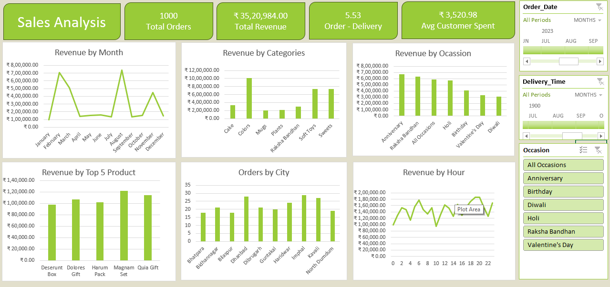

<!DOCTYPE html>
<head>
<body>

  <h1>Fern and Petals Sales Analysis (Excel Project)</h1>

  

    <h2> Overview</h2>
    
This project analyzes gift store sales data to extract meaningful insights like seasonal trends, regional performance, and top products. The analysis was performed using Microsoft Excel with Pivot Tables, Charts, and Dashboards.

  

  

    <h2>Objective</h2>
    <ul>
      <li>Identify peak sales months</li>
      <li>Analyze product performance</li>
      <li>Compare regional performance</li>
      <li>Find actionable business trends</li>
    </ul>
  

  

    <h2> Dataset</h2>
    
<strong>Source:</strong> Raw sales dataset (>10,000 records) in Sales Data directory 
    <strong>Raw Data Files:</strong> 
    <code>Sales Data/customers.csv</code>, 
    <code>Sales Data/products.csv</code>, and 
    <code>Sales Data/orders.csv</code>
         
    <strong>Analysed Data File:</strong> 
    <code>Sales Analysis.xlsx</code>
    

  

  

  

    <h2> Tools & Techniques</h2>
    <ul>
      <li>Microsoft Excel</li>
      <li>Pivot Tables</li>
      <li>Line, Bar, and Pie Charts</li>
      <li>Power Pivot</li>
      <li>Power Query</li>
      <li>Formulas: VLOOKUP, IF, SUMIFS, MATCH</li>
    </ul>
  

  

    <h2> Key Insights</h2>
    <ul>
      <li>Sales peaked in August due to Festivals</li>
      <li>Imphal city generated the most orders</li>
      <li>Highest revenue product: Magnam Set (₹1,20,000+)</li>
      <li>Highest revenue category: Colors (₹10,00,000+)</li>
      <li>Highest revenue category: Colors (₹10,00,000+)</li>
    </ul>
  

  

    <h2>How to Use</h2>
    
Download the Excel file and open it using Microsoft Excel. Use the dashboard sheet to explore filters and slicers.

  

  

    <h2> Dashboard Preview</h2>
    
  

  

    <h2>📬 Contact</h2>
    
Made by Aman Suthar 
    <a href="mailto:amansuthar699@gmail.com">amansuthar6992gmail.com</a> |
    <a href="https://www.linkedin.com/in/aman-suthar-01aa65217/">LinkedIn Profile</a>

  

</body>
</html>
